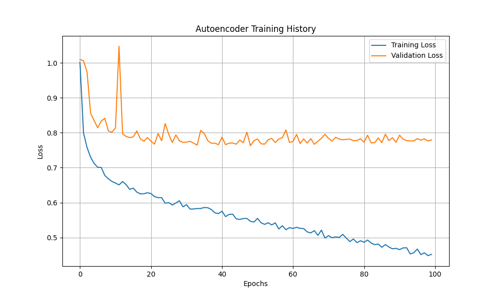
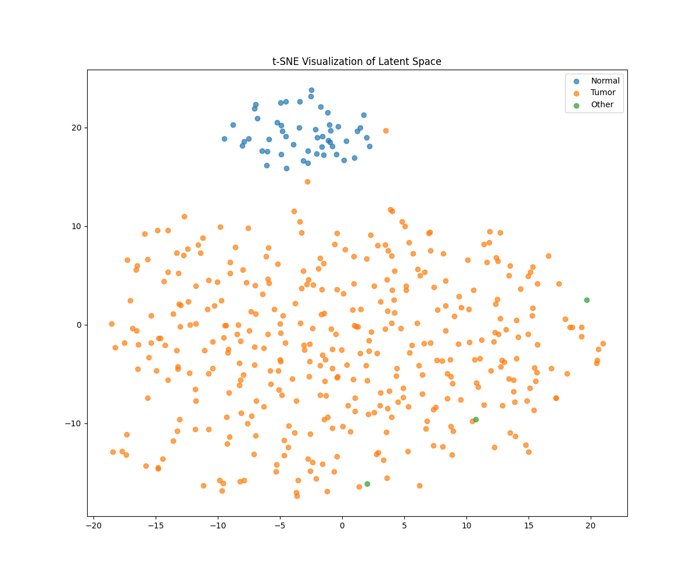
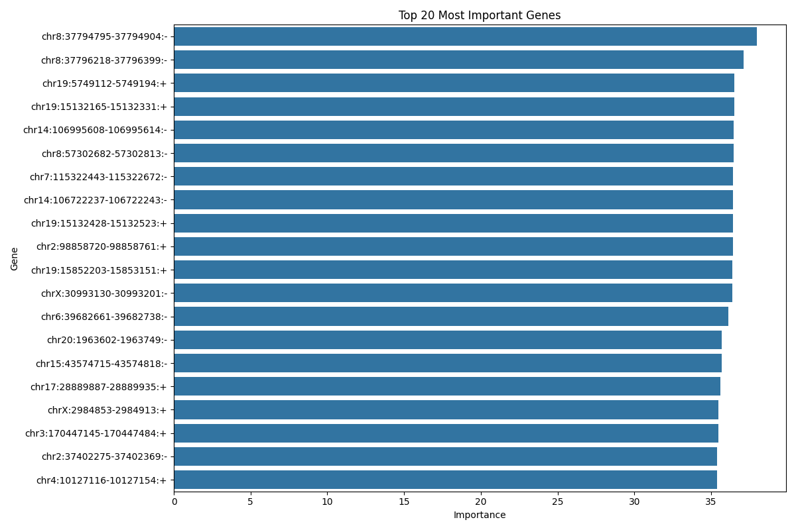

# TCGA Gene Expression Dimensionality Reduction using Deep Autoencoders

(Please add data)

[](https://pytorch.org)
[](https://portal.gdc.cancer.gov/)

A deep learning framework for analyzing high-dimensional gene expression data from The Cancer Genome Atlas (TCGA) using regularized autoencoder neural networks. This implementation enables efficient compression of ~20,000 gene features into a low-dimensional latent space while preserving biologically relevant patterns.


*Figure 1: Training progress showing reconstruction loss convergence*

## Scientific Context

Gene expression analysis faces the challenge of high dimensionality where the number of genetic features far exceeds available samples. Our deep autoencoder approach learns non-linear manifolds that capture essential biological variation while reducing noise. The TCGA BRCA dataset containing 1,218 samples with 20,531 gene features serves as the primary test case, though the architecture generalizes to other cancer types. Preprocessing follows established RNA-seq normalization practices including variance stabilization and log transformation.

## Methodology

### Neural Architecture

The symmetric autoencoder implements:  
```python
class Autoencoder(nn.Module):
    def __init__(self, input_dim=20531, hidden_dims=[1024, 512], latent_dim=32,
                 dropout_rate=0.2):
        super().__init__()
        # Encoder/Decoder built with modular blocks
```

The encoder pathway processes inputs through successive fully connected layers starting with 2048 units, followed by 512 units, using batch normalization and ReLU activation with dropout regularization before condensing to a 32-dimensional latent representation. The decoder reconstructs inputs through a mirrored architecture. The network employs He normal initialization with batch normalization and dropout for regularization, maintaining stable gradients during training.

### Data Processing Pipeline

Input data undergoes Z-score standardization per gene followed by an 85/15 stratified split preserving cancer subtype distributions. Batched loading through PyTorch DataLoader processes 256 samples at a time, with early stopping monitoring validation loss over 10 epochs to prevent overfitting while allowing sufficient training convergence.

### Analytical Framework


*Figure 2: t-SNE visualization of latent space (perplexity=30)*

Latent space analysis combines dimensionality reduction techniques including t-SNE and PCA for structural comparison, with UMAP for cluster visualization. Feature importance analysis uses gradient-based attribution methods and reconstruction error patterns to identify influential genes. Survival analysis incorporates proportional hazards modeling on latent dimensions and Kaplan-Meier curves comparing cluster-stratified patient outcomes.

 
*Figure 3: Top 20 genes by reconstructed feature importance*
